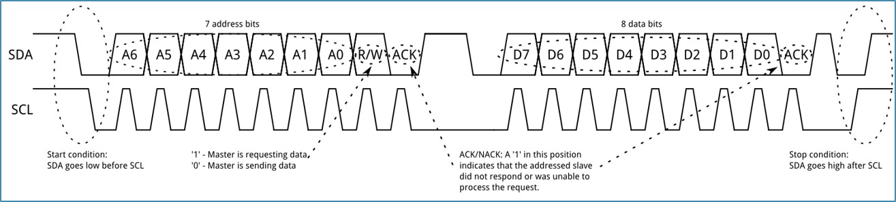
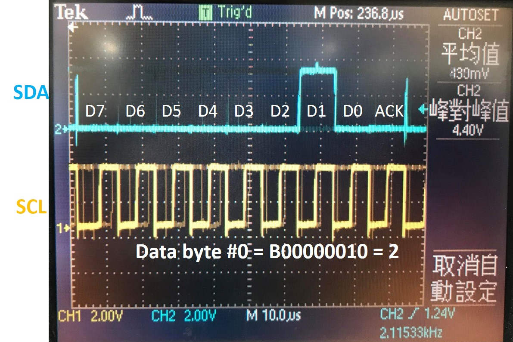
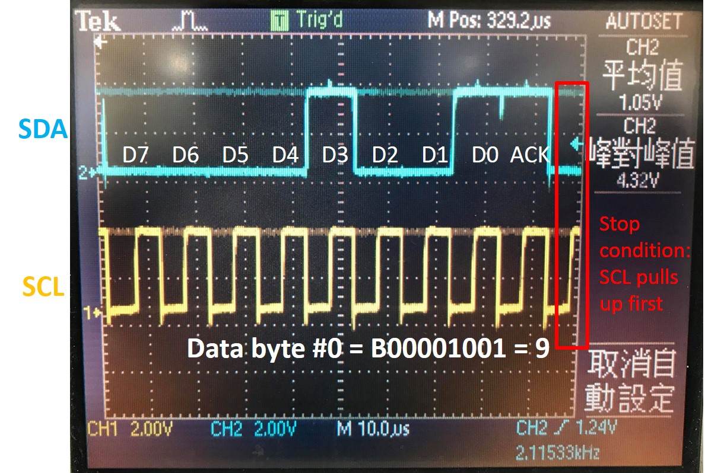
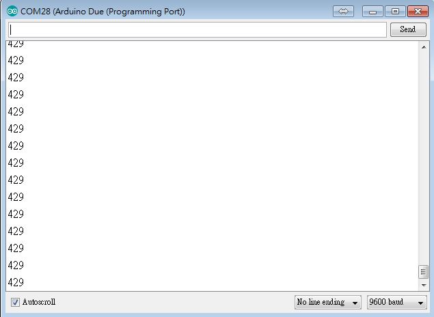
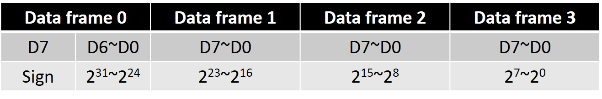

# Arduino_I2C_ReadEncoder
I2C implementation: Arduino Due serving as master receiver and Arduino Uno as slave transmitter (encoder reader).

## I2C protocol structure
  
- Start condition: SCL pulls low after SDA. 
- Address frame: 7 address bits + R/W operation bit + ack bit  
- Data frame: 8 bits + ack bit  
- Stop condition: SDA pulls high after SCL.  

## Demo
Example provided in code:   
- Encoder reading value 429 is broken down into a 3-byte array format = {4,2,9}.  
- Slave address: 0x72 (98 in decimal).  

## Logic analyzer
### Address frame
  
  
 
### data frame #0: decodes to 8-bit unsigned integer "4". 
  
  
 
### data frame #1: decodes to 8-bit unsigned integer "2".
  
  
 
### data frame #2: decodes to 8-bit unsigned integer "9".
  
  
 
### Reconstructing the three digits gives the original encoder reading = 429.
  

### Other data issues: real situation
Real encoder reading value range = 32-bit signed integer = -2^31 ~ (2^31 - 1)  
Reconstruct integer from received bit array (but in binary representation rather than decimal).  
4 data frames are needed.  

## REFERENCES
https://learn.sparkfun.com/tutorials/i2c  
